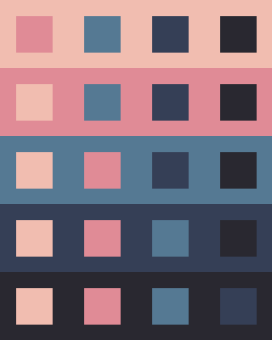

# PlasmaPlanet
####  Here, you'll find a series of progress reports as I embark on a journey of self discovery via video game development. Proceed with curiosity (and caution), and witness my software development skills rapidly grow right before your eyes! I genuinely don't know if this endeavor will turn into an actual playable game that you can enjoy, so you'll just have to stay tuned in order to find out! (Essentially a dev blog?)

	I'm a new follower in the cult of done. I want my github account to stand as a pillar of my dedication to being a Maker.

  !(My main inspiration)[https://www.youtube.com/watch?v=bJQj1uKtnus]

- ### Status Report: Tuesday 4/23/24
    
    - I decided I want this game to have that special ***Polished Aesthetics Deal*** which means a few things:
        
    	1. Palette palette palette!
            
        	- There's a big emphasis on this when it comes to how a game looks and feels.
            
            - I looked to Lospec to guide me, and added the colors I enjoyed to `palette.json`
        
        2. Art style!
            
            - Pixel art! Exercise my KISS bone! (referring to my new favorite mantra: "Keep it simple, stupid.")
            
            - Pixel art is *cool*. It lets me make *simple* things ***awesome***.
            
            - Upon the realization that hand drawing (or even computer aided) would be FAR too tedious I did what any good programmer does best--I wrote up `pixel_art_generator.py`, a script that generates sprite sheet and images for regular polygons using the color palettes I defined in a separate file. Pictured here is the encouraging results of that endeavor!

            .png)

- ### Status Report: Thursday 5/2/24
    
- Lots of project restructuring since last week and I'm still working through Pyglet's [in-depth asteroids tutorial.](https://pyglet.readthedocs.io/en/latest/programming_guide/examplegame.html#making-the-player-and-asteroid-sprites)
        
- Palette
    - I finished a swatch generator in `PixelArtist` (which is now located in the `asset_manager` submodule of `game`).
    - In the next iteration, I plan to have the palette name, and each color name and code included in the image.    
    - Mixing opacities would be helpful as well, so I can produce more possible gradients.
    - For the implementation, I ended up using `itertools.permutations` to get a list of each possible background and foreground, and then to get the size of the `.png` to create, I separated the list of tuples into a dict, where each key is the name of the background color, and the value is the slice of the permutations list where the background color appears first in the pair.

- Style
    - Moving forward, I'm going to be focusing on implementing an isometric grid to the game, and making more methods in PixelArtist.
    - I'm looking at buying [Aseprite $19.99](https://www.aseprite.org/), the tool of choice for *literally* every pixel artist on YouTube, since I know it won't exactly be reasonable to generate EVERY asset for the game (gotta keep it simple when I can).

    [Twilight 5 Palette by Star](https://lospec.com/palette-list/twilight-5)

    

    [Cryptic Ocean Palette by Kaflooty](https://lospec.com/palette-list/cryptic-ocean)

    

**Moving Forward**

- ### Status Report: Monday 5/6/24
	- I decided that no matter how exciting the finished result is in my mind, it will be 1000000% better if I can plan out my steps methodically and thoughtfully. That's how I maximize productivity. I must first have a clear vision of where I want to go.
  	- ~Palette~ Art & Design
  		- Came across a $0.99/mo Asesprite clone for iPad/iPhone called  and it's been working out really great!
    		- This morning I created a font as a horizonatal spritesheet in Resprite, and as of right now, I'm able to render that font onto the game screen which is extremely gratifying. I really can't express how cool I feel just knowing that I drew all of the text rendered on the screen for my game by *hand*.

  	   

  	   
  	
   	- I had a one night stand with Godot in a deserate attempt to just *see* my cute little cubes on the screen in an isometric grid... It worked of course, but at what cost? I decided to come back because I want to understanding of having my hand in every singe aspect of the game that I'm creating. It almost felt like... Cheating? My resolve is that I want my game to look like the absolute best that I can produce on my own. Using only that skills that I have built up in all of this time since I started coding. Yes, I have high expectations, but that's only because the push towards something greater than where I'm at right now *drives* me.

  	So, ***onward and upward***
   

  - ### Status Report: Thrusday 5/9/24
  	- I still need to determine a definitive direction that I'm trying to go with this. When I close my eyes, what is it that I see? What game do I want to play?
   	- Reinvigorated by the need to have something I can playtest, I went back to Pyglet's Asteroid example and added any relevant files from the examples subdirectory of that . I'm sorta caught between this desire to make everything OOP, and dreading the coupling that that can bring. It almost feels unneccessary right now? Like I can do without, I can treat all the functionality more modularly, if I decide to first employ funcitonal programming. 
	- I'm finding that I want to publish my game online! More on that later.
   	- Sometimes it's difficult to make sure I get everything I can into this report!
    - I realized that the real crux of this project is going to be the mechanism that takes in a 3d object (rather, the digital representation of it, such as a unit tetrahedron), aloows for proccesses to happen to that object (like a 30 degress rotation along the z axis, for instance), and finally outputs the modified data initially input, plus any manipulations that need to occur so that it can appear in a pixelated, isometric view.

			That's.... what.. rendering.... is.
- For some visual updates, here's a screenshot of what my custom font looked like loaded into the game on Tuesday:
  	
