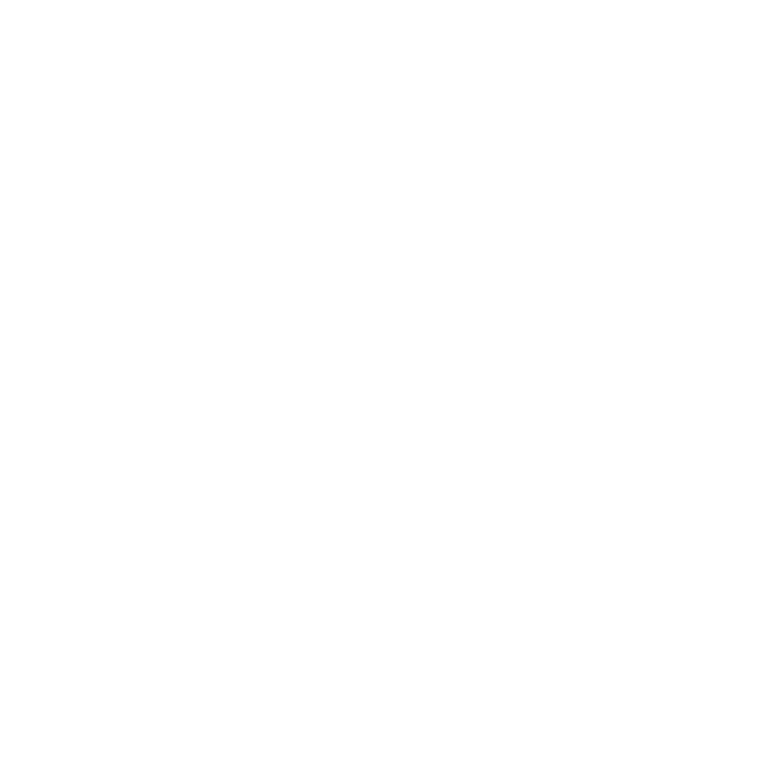

# PlasmaPlanet
####  Here, you'll find a series of progress reports as I embark on a journey of self discovery via video game development. Proceed with curiosity (and caution), and witness my software development skills rapidly grow right before your eyes! I genuinely don't know if this endeavor will turn into an actual playable game that you can enjoy, so you'll just have to stay tuned in order to find out!

	I'm a new follower in the cult of done.
    and this github account shall hence forth be a testiment to that.

- ### Status Report: Tuesday 4/23/24
    
    - I decided I want this game to have that special ***Polished Aesthetics Deal*** which means a few things:
        
    	1. Palette palette palette!
            
        	- There's a big emphasis on this when it comes to how a game looks and feels.
            
            - I looked to Lospec to guide me, and added the colors I enjoyed to `palette.json`
        
        2. Art style!
            
            - Pixel art! Exercise my KISS bone! (referring to my new favorite mantra: "Keep it simple, stupid.")
            
            - Pixel art is *cool*. It lets me make *simple* things ***awesome***.
            
            - Upon the realization that hand drawing (or even computer aided) would be FAR too tedious I did what any good programmer does best--I wrote up `pixel_art_generator.py`, a script that generates sprite sheet and images for regular polygons using the color palettes I defined in a separate file. Pictured here is the encouraging results of that endeavor!

            .png)

- ### Status Report: Thursday 5/2/24
    
    - Lots of project restructuring since last week and I'm still working through Pyglet's [in-depth asteroids tutorial.](https://pyglet.readthedocs.io/en/latest/programming_guide/examplegame.html#making-the-player-and-asteroid-sprites)
        
        1. Palette
            
            - I finished a swatch generator in `PixelArtist` (which is now located in the `asset_manager` submodule of `game`).
            
            - In the next iteration, I plan to have the palette name, and each color name and code included in the image.
            
            - Mixing opacities would be helpful as well, so I can produce more possible gradients.
            
            - For the implementation, I ended up using `itertools.permutations` to get a list of each possible background and foreground, and then to get the size of the `.png` to create, I separated the list of tuples into a dict, where each key is the name of the background color, and the value is the slice of the permutations list where the background color appears first in the pair.
        
        2. Style
            
            - Moving forward, I'm going to be focusing on implementing an isometric grid to the game, and making more methods in PixelArtist.
            
            - I'm looking at buying [Aseprite $19.99](https://www.aseprite.org/), the tool of choice for *literally* every pixel artist on YouTube, since I know it won't exactly be reasonable to generate EVERY asset for the game (gotta keep it simple when I can).
 
            [Twilight 5 Palette by Star](https://lospec.com/palette-list/twilight-5)

            

            [Cryptic Ocean Palette by Kaflooty](https://lospec.com/palette-list/cryptic-ocean)

            

	**Moving Forward**

- ### Status Report: Monday 5/6/24

	- I decided that no matter how exciting the finished result is in my mind, it will be 1000000% better if I can plan out my steps methodically and thoughtfully. That's how I maximize productivity. I must first have a clear vision of where I want to go.
 	1. Palette
  		- Came across a $0.99/mo Asesprite clone for iPad/iPhone called  and it's been working out really great!
    		- This morning I created a font as a horizonatal spritesheet in Resprite, and as of right now, I'm able to render that font onto the game screen which is extremely gratifying. I really can't express how cool I feel just knowing that I drew all of the text rendered on the screen for my game by *hand*.
      		
        	
